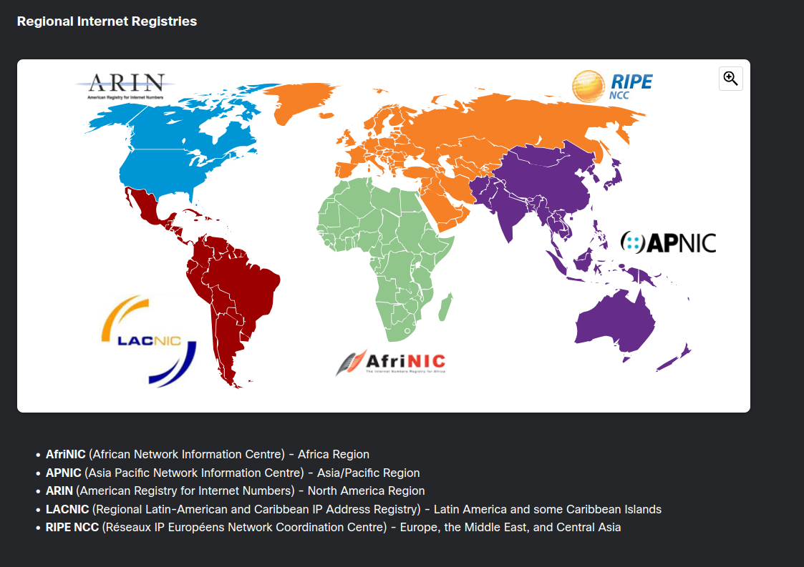

Internet Assigned Numbers Authority or simply IANA is the organization responsible for allocating block of IPv4 and IPv6 addresses to the 5 Regional Internet Registers.
RIRs are responsible for allocating IP addresses to ISPs who provide IPv4 address blocks to organizations and smaller ISPs. Organizations can also get their addresses directly from an RIR (subject to the policies of that RIR).

